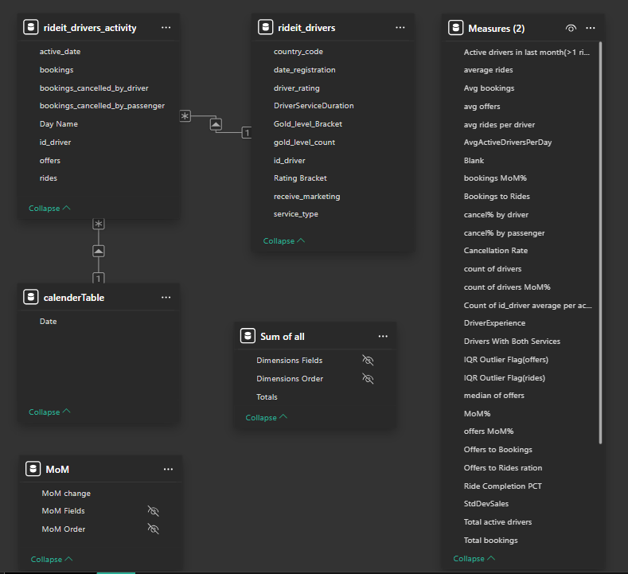
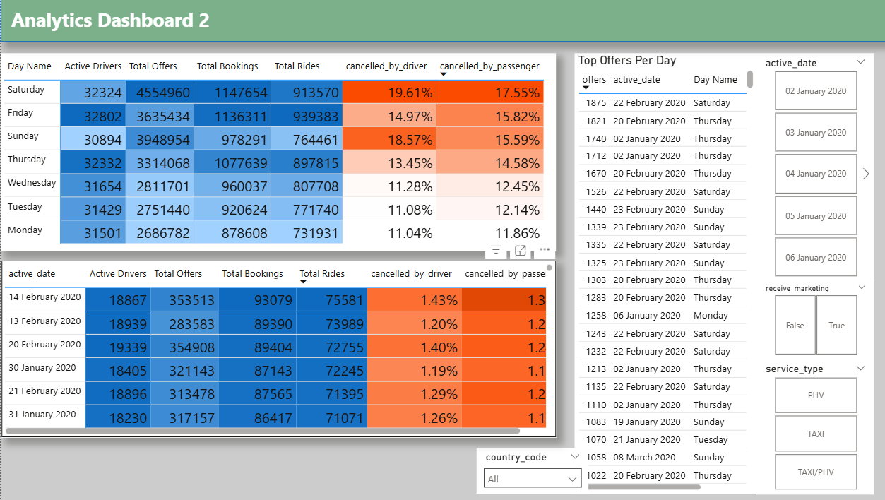

# Ride-it analysis — Driver engagement & operational metrics

**Repository:** `https://github.com/yan-jan-ram/Ride-it-analysis`  
**Short summary:** Power BI project analysing driver engagement and operations using two primary datasets (driver master + driver activity). Excel used for initial cleaning, Power BI for model, DAX measures, dashboards and reporting. CSVs are **not** included for security reasons.

---

## Business objective
Help operations and product teams monitor driver engagement and operational health:
- Measure offers → bookings → rides funnel and conversion ratios.
- Track driver activity (active drivers, MoM changes).
- Monitor cancellation rates and surface outliers (offers/rides).
- Provide operational KPIs (total rides, total bookings, completion %, cancellations).

---

## Tech stack
- Power BI Desktop (data model, DAX, visuals)
- Microsoft Excel (initial ETL/merge)
- DAX for measures & time-intelligence
- GitHub — documentation & screenshots

---

## What’s included in this repo
- `screenshots/` — dashboard & model images (visual proof; upload these)
- `docs/` (optional) — metric definitions & notes
- `README.md` (this file)

> **Note:** The original CSVs (`rideit_drivers.csv`, `rideit_drivers_activity.csv`) are confidential and therefore not stored in this public repo. Instead, screenshots and metric definitions are provided.

---

## DAX Measures

#### Active drivers in last month (>=1 ride)
```
Active drivers in last month(>1 ride) =
CALCULATE(
    DISTINCTCOUNT(rideit_drivers_activity[id_driver]),
    FILTER(rideit_drivers_activity, rideit_drivers_activity[rides] >= 1),
    DATESINPERIOD(rideit_drivers_activity[active_date],
                  MAX(rideit_drivers_activity[active_date]),
                  -30, DAY)
)
```
#### Bookings to Rides ratio
```
Bookings to Rides =
DIVIDE([Total rides], [Total bookings])
```
#### Cancellation Rate (overall)
```
Cancellation Rate =
1 - ([Total rides] / [Total bookings])
```
#### MoM% pattern (example for bookings)
```
bookings MoM% =
IF(
    ISFILTERED('rideit_drivers_activity'[active_date]),
    ERROR("Time intelligence quick measures can only be grouped or filtered by the Power BI date hierarchy."),
    VAR __PREV_MONTH =
        CALCULATE(
            SUM('rideit_drivers_activity'[bookings]),
            DATEADD(calenderTable[Date], -1, MONTH)
        )
    RETURN DIVIDE(SUM('rideit_drivers_activity'[bookings]) - __PREV_MONTH, __PREV_MONTH)
)
```
#### IQR outlier flag for offers (global context)
```
IQR Outlier Flag(offers) =
VAR CurrentValue = SELECTEDVALUE(rideit_drivers_activity[offers])
VAR Q1 = CALCULATE(PERCENTILE.INC(rideit_drivers_activity[offers], 0.25), ALL(rideit_drivers_activity))
VAR Q3 = CALCULATE(PERCENTILE.INC(rideit_drivers_activity[offers], 0.75), ALL(rideit_drivers_activity))
VAR IQR = Q3 - Q1
VAR LowerBound = Q1 - 1.5 * IQR
VAR UpperBound = Q3 + 1.5 * IQR
RETURN
IF(
    ISBLANK(CurrentValue),
    BLANK(),
    IF(CurrentValue < LowerBound || CurrentValue > UpperBound, "Outlier", "Normal")
)
```
## Key dashboards / screenshots
Place the following screenshots inside `screenshots/` (recommended filenames shown). Then these images will render automatically.






